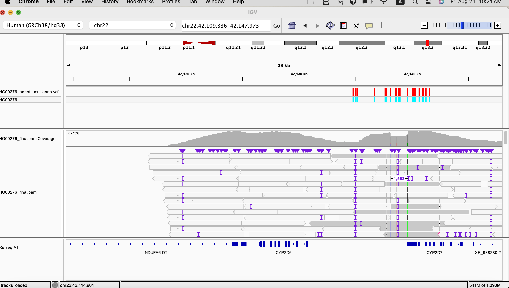

# PacBio Long-Read Pharmacogenomics (PGx) Pipeline

## Project Overview
This repository implements an end-to-end bioinformatics pipeline for PacBio HiFi long-read sequencing data, specifically targeting the Twist Alliance Long-Read PGx panel. The workflow resolves **49 key pharmacogenomic genes** (including *CYP2D6* and *CYP2C19*) that are traditionally difficult to analyze using short-read sequencing due to high sequence homology, pseudogenes, and structural variation.

---

## Tools & Technologies
* **Alignment:** Minimap2 (`map-hifi` preset)
* **Data Processing:** Samtools (Read Group injection & BAM indexing)
* **Variant Calling:** GATK4 HaplotypeCaller & GenotypeGVCFs (v4.6.2.0)
* **Functional Annotation:** ANNOVAR (`table_annovar.pl` integrating RefGene, ClinVar, and dbNSFP)
* **Visual Validation:** Integrative Genomics Viewer (IGV)
* **Target Panel:** 49 PGx genes in "dark/complex" genomic regions

---

## Pipeline Workflow
FASTQ (PacBio HiFi)
│
▼
[Minimap2] ──> SAM ──> [Samtools] ──> Sorted & Labeled BAM
│
▼
[GATK4 HaplotypeCaller] ──> GVCF
│
▼
[GATK4 GenotypeGVCFs] ──> Raw VCF
│
▼
[ANNOVAR Annotation] ──> Annotated VCF
│
▼
[IGV Inspection] ──> Visual Validation

1. **Alignment:** Align raw FASTQ reads to GRCh38/hg38 reference using `minimap2 -ax map-hifi`.
2. **Read Group Standardization:** Inject `@RG` headers via `samtools addreplacerg` for downstream GATK compatibility.
3. **Genomic Variant Calling:** Run GATK4 `HaplotypeCaller` in `-ERC GVCF` mode to evaluate variant sites.
4. **Joint Genotyping:** Execute `GenotypeGVCFs` to generate finalized, multi-allele VCF calls.
5. **Functional Annotation:** Annotate variants using ANNOVAR (`table_annovar.pl`) with `refGene`, `clinvar`, and `dbnsfp42a` databases to capture gene structure and clinical significance.
6. **Visual Inspection:** Verify complex variants and phasing in IGV across high-priority loci (*CYP2D6*).

---

## Repository Structure
pacbio-pgx-pipeline/
├── scripts/
│   └── run_pgx_pipeline.sh          # Full automated bash execution script
├── results/
│   └── sample_annovar_output.vcf    # Verification snippet of annotated VCF output
├── images/
│   └── cyp2d6_variant.png           # IGV alignment visualization screenshot
└── README.md                        # Project documentation

---

## Key Pipeline Outputs

| File Name | Format | Location / Context | Description |
| :--- | :--- | :--- | :--- |
| `run_pgx_pipeline.sh` | Shell | `scripts/` | Executable bash script containing end-to-end commands |
| `HG00276_final.bam` | BAM | Local Execution | Read-group labeled BAM file ready for IGV alignment inspection |
| `HG00276_final_variants.vcf` | VCF | Local Execution | Finalized variant call file generated by GATK4 |
| `sample_annovar_output.vcf` | VCF | `results/` | Verification snippet containing ANNOVAR functional annotations |
| `cyp2d6_variant.png` | PNG | `images/` | Visual proof of HiFi read alignment over the *CYP2D6* locus in IGV |

---

## Visual Validation (IGV)
Below is the visual verification of PacBio HiFi reads aligned over the *CYP2D6* region. Long reads spanning the region confirm high-confidence alignment without mapping ambiguity from neighboring pseudogenes (*CYP2D7*):

---

## Summary of Results
The pipeline successfully identified and functionally annotated variants across the 49 target PGx genes. Utilizing PacBio long-read technology enabled clear read mapping and variant identification in complex loci like *CYP2D6*, overcoming the mapping challenges common in short-read datasets.